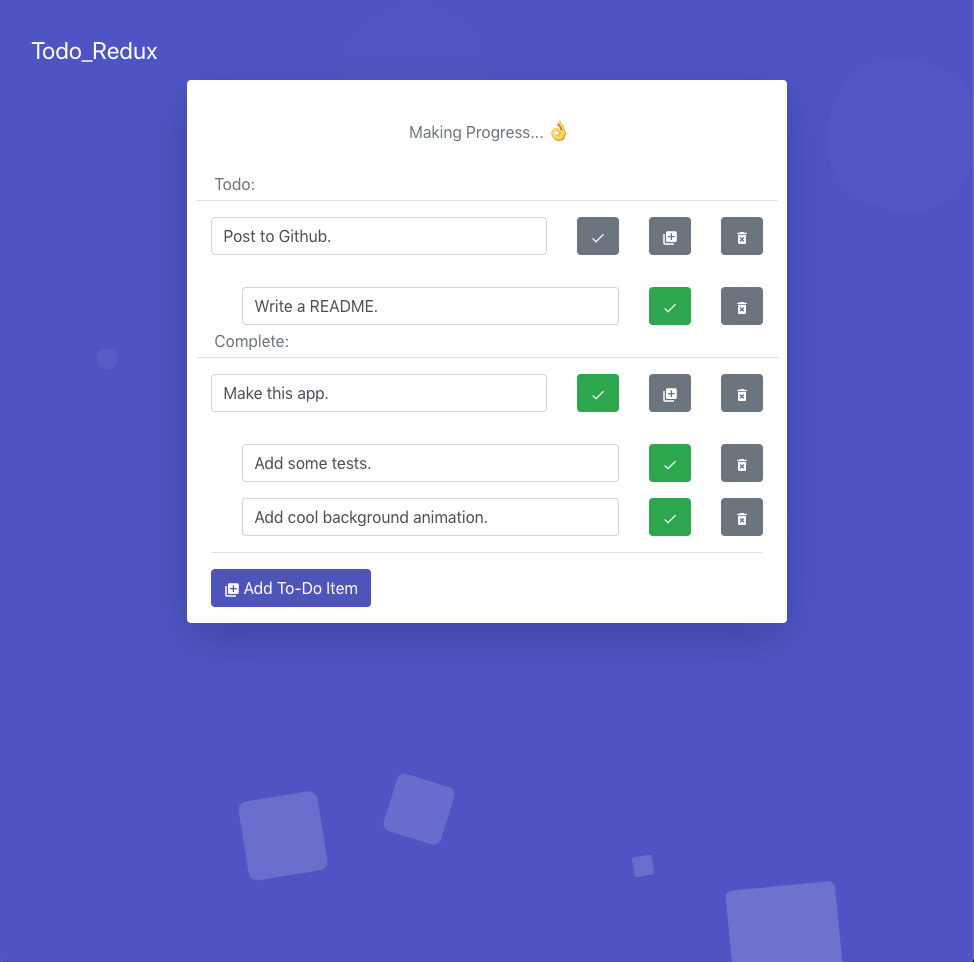

## Todo_Redux  
  
This is a self-challenge to build a To-Do App utilizing React and Redux.
  
## Features
- Ability to Add Todo Items  
- Ability to Remove Todo Items  
- Ability to Complete Todo Items  
- Ability to have Child Todo Items w/ same features.  
- Completed Items show in separate list.
  
## Notes  
- If the Parent Item of a Child Item is completed, then the Child Item is also completed.  
- If a Child Item is un-completed, then its Parent Item is also un-completed.
- If the Parent Item of a Child Item is deleted, then the Child Item is also deleted.
- Completed Items are ordered by when they were completed, with most recent at the top.
    
## How to run the app  
1. Clone the repo.  
2. Run `yarn && yarn start` to install packages and then navigate to localhost.

## Example
